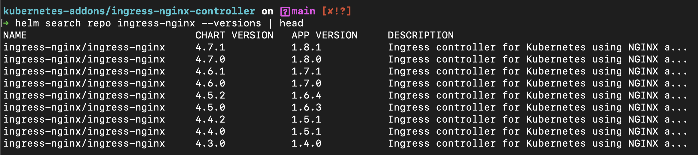
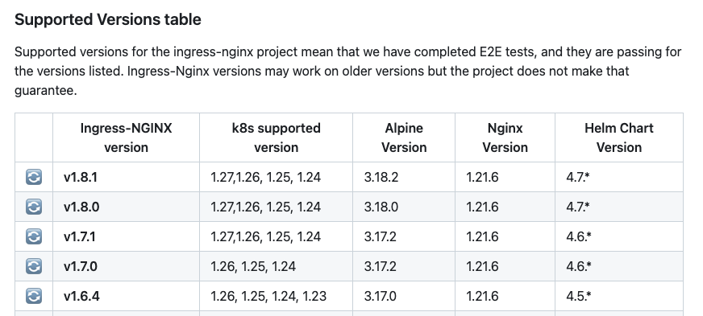

# Ingress Nginx Controller
Helm을 사용한 Ingress Nginx Controller 설치 및 설정

## Type
- External Ingress Controller
- Internal Ingress Controller

## 설치 순서

1. Namespace 생성

    ```
    k create ns ingress-nginx
    ```

2. 작업 환경에 Helm Repo 추가

    ```
    helm repo add ingress-nginx https://kubernetes.github.io/ingress-nginx
    helm repo update
    ```

3. User Value 설정

    3.1 Default Value를 분석

    ```
    # Get Default Values
    helm show values ingress-nginx/ingress-nginx > values.yaml
    ```

    3.2 필요한 Value값 선정 및 수정
    
    Ingress Controller Annotaion에 Azure Load Balancer의 Health 체크용 Endpoint를 기입, *Chart의 Default Value 값 중 ```healthCheckPath: "/healthz"```와 동일하게 맞춰줌

    [external-ingress-values.yaml](./values/external-ingress-values.yaml)

4. 클러스터에 Chart 설치

    ```
    # helm install [NAME] [CHART] [flags]
    helm install <RELEASE_NAME> ingress-nginx/ingress-nginx --version <CHART_VERSION> -n <NAMESPACE>> -f <USER_VALUE_FILE>.yaml
    ```

5. 설치된 릴리즈 확인

    ```
    # Check Installed chart (release)
    helm ls -n ingress-nginx

    # Check value (user values)
    helm get values ingress-nginx -n ingress-nginx
    ```

## 버전 업그레이드
k8s 버전 업그레이드를 진행할 경우 Ingress Nginx Controller와 버전 호환성을 확인해서 함께 버전 관리를 해주어야 합니다.

1. 작업환경에 설치된 차트의 버전 살펴보기

    ```
    helm repo update
    helm search repo ingress-nginx --versions
    ```
    

2. 공식 저장소에서 k8s 버전과 호환성 확인

    [supported-versions-table](https://github.com/kubernetes/ingress-nginx#supported-versions-table)
    

3. 버전 업그레이드

    > 사용하고 있던 User Value를 유지하기 위해서는 기존 Value 파일을 함께 Flag로 지정하거나 혹은 기존 Value를 유지하는 옵션을 사용해줍니다.
    ```
    # helm upgrade [RELEASE] [CHART] [flags]
    helm upgrade <RELEASE_NAME> ingress-nginx/ingress-nginx --version <CHART_VERSION> -n <NAMESPACE> [-f <USER_VALUE_FILE>.yaml | --reuse-values]
    ```

## NGINX Configuration
Configmap은 글로벌 설정이며, Annotation은 Object 별로 설정이 필요할때 사용합니다. [공식문서](https://kubernetes.github.io/ingress-nginx/user-guide/nginx-configuration/#nginx-configuration
)

- Configmap: 글로벌 설정, Configmap 이름과 인그레스 컨트롤러 이름을 같게하여 인그레스 컨트롤러 단위로 nginx 설정 적용 가능
- Annotation: 개별 설정, Ingress Object 생성 시 Annotation에 Nginx Configuration을 기입하여 개별로 적용 가능
- 주의사항 및 동작원리

    - Configmap의 Namespace와 Name은 Controller와 같아야 합니다.

    - Helm value에서 Configmap 참조방식을 변경하지 않은 경우 기본값으로 다음과 같이 세팅됩니다. (Controller Pod 의 네임스페이스와 Release이름 참조)

        > Controller Pod's args: ```--configmap=$(POD_NAMESPACE)/<RELEASE>-controller```

- 샘플 구성

    [config/configmap.yaml](./config/configmap.yaml)
## NGINX Monitoring - Prometheus
프로메테우스에 Nginx Controller 메트릭 수집가능하도록 설정
- [external-ingress-values-monitoring.yaml](./values/external-ingress-values-monitoring.yaml)
- Docs: https://github.com/kubernetes/ingress-nginx/blob/main/docs/user-guide/monitoring.md#monitoring

## NGINX Logging
NGINX Controller Pod의 STDOUT으로 확인 가능합니다.

- Log Format

    https://kubernetes.github.io/ingress-nginx/user-guide/nginx-configuration/log-format/

## NGINX TLS Termination
- TLS Termination

    https://kubernetes.github.io/ingress-nginx/user-guide/tls/

# External and Internal Ingress
### 목적

인그레스를 External (Public IP), Internal (Private IP) 용도로 분리하여 구성

### 작업 환경

1. AKS (k8s v1.26.6)
2. Ingress Nginx Chart 4.8.3 (nginx v1.9.4)

### Value 설정

1. External Ingress
    
    ```
    # External Ingress Controller in AKS
    controller:
    service:
        annotations: 
        service.beta.kubernetes.io/azure-load-balancer-health-probe-request-path: /healthz
    electionID: external-ingress-controller-leader
    ingressClassResource:
        name: nginx-external
        enabled: true
        default: false
        controllerValue: "k8s.io/external-ingress-nginx"
    ingressClass: nginx-external
    ```
2. Internal Ingress
    ```
    # Internal Ingress Controller in AKS
    controller:
    service:
        annotations: 
        service.beta.kubernetes.io/azure-load-balancer-health-probe-request-path: /healthz
        service.beta.kubernetes.io/azure-load-balancer-internal: true
        loadBalancerIP: 10.224.224.100
    electionID: internal-ingress-controller-leader
    ingressClassResource:
        name: nginx-internal
        enabled: true
        default: false
        controllerValue: "k8s.io/internal-ingress-nginx"
    ingressClass: nginx-internal
    ```
### 차트 배포

    ```
    # helm install [NAME] [CHART] [flags]
    helm install ingress-nginx-[internal | external] ingress-nginx/ingress-nginx --version <CHART_VERSION> -n ingress-nginx -f [internal | external]-ingress-values.yaml
    ```
---
### Ref.
- Ingress Nginx Official Repo
  
  https://github.com/kubernetes/ingress-nginx

- AKS Docs
  
  https://learn.microsoft.com/ko-kr/azure/aks/ingress-basic?tabs=azure-cli