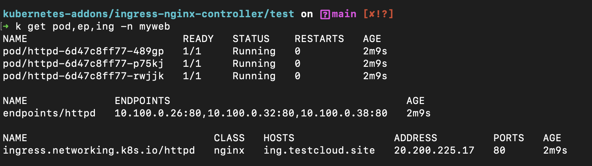
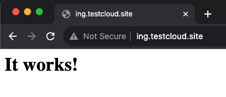

# Ingress Nginx Controller
Helm을 사용한 Ingress Nginx Controller 설치 및 튜닝 <br>
*주의: k8s 버전 업그레이드에 맞춰 Ingress Nginx 컨트롤러의 버전도 호환성을 체크하여 업그레이드 해주어야 한다.

## 설치 순서

1. Create Namespace

    ```
    k create ns ingress-nginx
    ```

2. Setup Helm repo

    ```
    helm repo add ingress-nginx https://kubernetes.github.io/ingress-nginx
    helm repo update
    ```

3. Customize Values

    ```
    helm show values ingress-nginx/ingress-nginx > values.yaml

    cp values.yaml user-values.yaml

    # vi user-values.yaml
    controller:
      service:
        annotations: 
          service.beta.kubernetes.io/azure-load-balancer-health-probe-request-path: /healthz

    ```
4. Install Chart (To be Release)

    ```
    helm install ingress-nginx ingress-nginx/ingress-nginx -n ingress-nginx -f user-values.yaml
    ```

5. Check installation

    ```
    # Check Installed chart (release)
    helm ls -n ingress-nginx

    # Check value (user values)
    helm get values ingress-nginx -n ingress-nginx
    ```

## 특정 버전 설치 or 업그레이드
### 특정 버전 설치 가이드

1. 차트 버전 살펴보기

    ```
    helm search repo ingress-nginx --versions
    ```
    

2. 공식 문서 참고해서 k8s 버전과 호환되는 버전으로 선택

    [supported-versions-table](https://github.com/kubernetes/ingress-nginx#supported-versions-table)
    

2. 버전 지정하여 설치

    ```
    helm install ingress-nginx ingress-nginx/ingress-nginx --version <CHART_VERSION> -n ingress-nginx -f user-values.yaml
    ```


### 차트 버전 업그레이드
1. 위 1,2번과 같은 방식으로 k8s 버전과 호환성 확인
2. 차트 업그레이드

    ```
    helm upgrade -n ingress-nginx ingress-nginx ingress-nginx/ingress-nginx --version <CHART_VERSION>
    ```
> user value 값은 업그레이드 하더라도 변하지 않음

## NGINX Configuration (Tuning)
- Configmap은 글로벌 설정, Annotation은 개별 설정이며 튜닝 가능한 옵션은 공식 문서 참조하여 구현

    https://kubernetes.github.io/ingress-nginx/user-guide/nginx-configuration/#nginx-configuration
- Configmap 설정 테스트

1. 설정내용

    controller pod의 args를 보면 ```--configmap=$(POD_NAMESPACE)/ingress-nginx-controller```로 같은 네임스페이스의 ingress-nginx-controller 이름의 configmap을 참조하는것을 확인할 수 있으므로, 아래와 같이 네임스페이스를 동일하게 하여 적용

    [config/configmap.yaml](confing/config.yaml)

    ```
    apiVersion: v1
    data:
      proxy-connect-timeout: "10"
      proxy-read-timeout: "120"
      proxy-send-timeout: "120"
    kind: ConfigMap
    metadata:
      name: ingress-nginx-controller
      namespace: ingress-nginx
    ```


2. 확인
nginx reload 확인 및 컨테이너 내 설정값 까지 확인

    ```  
    k describe pod <POD_NAME> -n ingress-nginx
    Events:
    ...
    Normal   RELOAD             10m (x2 over 33m)  nginx-ingress-controller  NGINX reload triggered due to a change in configuration


    k exec -it -n ingress-nginx <POD_NAME> -- /bin/bash
    cat nginx.conf
    ...
    proxy_connect_timeout                   10s;
    proxy_send_timeout                      120s;
    proxy_read_timeout                      120s;
    ...
    ```
## NGINX Logging
NGINX Controller Pod의 STDOUT으로 확인 가능

- Log Format

    https://kubernetes.github.io/ingress-nginx/user-guide/nginx-configuration/log-format/
## NGINX TLS Termination
- TLS Termination

    https://kubernetes.github.io/ingress-nginx/user-guide/tls/

## 라우팅 테스트
Sample image == httpd, 
인그레스 오브젝트와 백앤드서비스(ClusterIP)는 같은 Namespace에 존재해야함
1. Deployment and Service

    ```
    k create deployment simple-webapp --image=httpd --replicas=3 --port=80 --dry-run=client -o yaml > deployment.yaml
    ```
2. Ingress

    ```
    k create ingress simple --rule=ing.testcloud.site/=httpd:80 --class=nginx --dry-run=client -o yaml > ingress.yaml 
    ```
3. 생성 및 라우팅 확인

    Ingress Object의 IP를 (임시) /etc/hosts 또는 사용중인 DNS에 A record로 등록

    

    

### Ref.
- Ingress Nginx Official Repo
  
  https://github.com/kubernetes/ingress-nginx

- AKS Docs
  
  https://learn.microsoft.com/ko-kr/azure/aks/ingress-basic?tabs=azure-cli