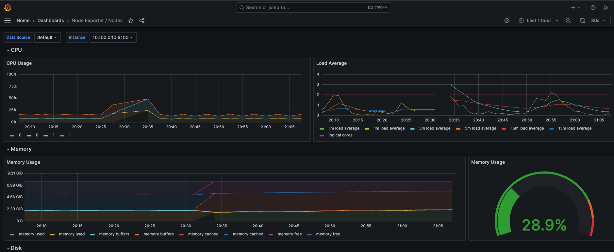
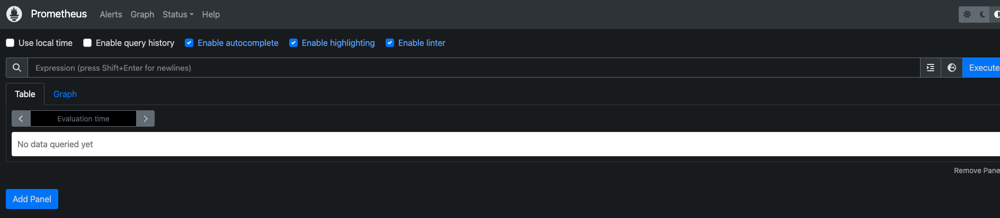

# kube-prometheus-stack
helm 으로 Prometheus Stack 설치

# Prerequisite
1. Kubernetes 1.16+
2. Helm 3+
## Version info
- stack version: 48.4.0
- app version: v0.66.0
## Stack Component
- The Prometheus Operator
- Highly available Prometheus
- Highly available Alertmanager
- Prometheus node-exporter
- Prometheus Adapter for Kubernetes Metrics APIs
- kube-state-metrics
- Grafana

# 설치 순서
1. Create namespace

    ```bash
    k create ns monitoring
    ```
2. Create StorageClass

    프로메테우스의 데이터 저장용

    [storageclass.yaml](storageclass.yaml)

3. Add Helm repo 

    ```bash
    helm repo add prometheus-community https://prometheus-community.github.io/helm-charts
    helm repo update
    # 확인
    helm search repo prometheus-community
    ```
4. Edit user value
    - k8s version, label, grafana timezone, pw, prometheus retention, volume
    ```bash
    # 참조할 value.yaml 생성
    helm show values prometheus-community/kube-prometheus-stack > values.yaml
    ```
    ```bash
    # 새로운 파일로 user value 커스텀
    # vi user-values.yaml
    ## Provide a k8s version to auto dashboard import script example: kubeTargetVersionOverride: 1.16.6
    kubeTargetVersionOverride: "1.26.6"

    ## Labels to apply to all resources
    commonLabels:
      mgmt: monitoring

    ## Timezone for the default dashboards and password
    grafana:
      defaultDashboardsTimezone: kst
      adminPassword: admin

    # prometheus volumes
    prometheus:
      prometheusSpec:
        ## How long to retain metrics
        retention:  14d
        ## Prometheus StorageSpec for persistent data
        storageSpec:
          volumeClaimTemplate:
            spec:
              storageClassName: azuredisk-ssdlrs # 앞에서 만든 StorageClass Name
              accessModes: ["ReadWriteOnce"]
              resources:
                requests:
                  storage: 10Gi
    ```
5. Install Chart
    ```bash
    helm install [RELEASE_NAME] prometheus-community/kube-prometheus-stack -f user-values.yaml -n monitoring
    ```
6. Grafana, Prometheus Service Open

    그라파나, 프로메테우스 외부 노출용 서비스

    [service.yaml](service.yaml)

7. 확인

    - 배포 확인

        ```bash
        kubectl get all -n monitoring
        ```
    - 서비스 접속

        - 그라파나
            
                    

        - 프로메테우스

            
### Ref
- 아티팩트 허브 kube-prometheus-stack

    https://artifacthub.io/packages/helm/prometheus-community/kube-prometheus-stack

- 공식 깃헙 Prometheus Community Kubernetes Helm Charts
    
    https://github.com/prometheus-community/helm-charts/


- 공식 깃헙 kube-prometheus

    https://github.com/prometheus-operator/kube-prometheus

- 프로메테우스 스토리지 참고

    https://github.com/prometheus-operator/prometheus-operator/blob/main/Documentation/user-guides/storage.md